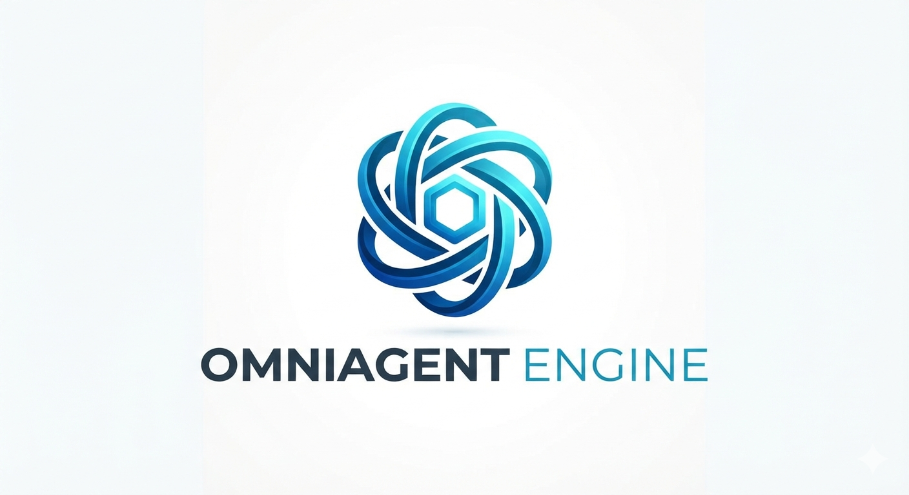

<p align="center">
  
</p>

# OmniAgent Engine 🤖

The Cross-Language Autonomous Agent Hub. A high-performance, completely decoupled monorepo housing specialized, independent AI agents built across Python, Java, and LangChain frameworks to solve distinct enterprise automation use cases.

---

## 🧭 Agent Registry

| Agent Name                                                    | Technology Stack | Status                    | Primary Capability |
|:--------------------------------------------------------------| :--- |:--------------------------| :--- |
| [PublisherAi](./agents/PublisherAI/streamlit_app.py)          | Python, LangChain, OpenAI | `Initial Setup Completed` | PublishAI is a Streamlit-based AI content agent that researches a topic on the web, reads real source articles, and generates a polished, ready-to-publish draft — a LinkedIn post, a Dev.to article, a README, or a research summary — in the correct format and tone for that content type. Drafts are saved automatically as Markdown files and shown in a built-in article library. |
| [Email Summarizer](./agents/email-summarizer-py)              | Python, LangChain, OpenAI | `In Progress`             | Extracts action items and summaries from raw emails. |

---

## 🏛️ Architecture Philosophy

The **OmniAgent Engine** operates as a **Polyglot Monorepo**:
* **Complete Isolation:** Each agent lives in its own directory with distinct dependencies, runtimes, and local environments.
* **Zero Coupling:** Agents do not share code or depend on one another, preventing cascading failures or framework conflicts.
* **Plug-and-Play Design:** Adding a new agent requires zero modification to existing agents.

---

## 🚀 Quick Start & Local Execution

Because every agent uses a unique runtime, please navigate to the specific agent's folder for dedicated setup and execution instructions.

```bash
# Clone the repository
git clone https://github.com
cd omniagent-engine

# Navigate to a specific agent folder
cd agents/email-summarizer-py
cat README.md  # Follow isolated setup steps
```

### 🧪 Local Testing Strategy

Since this project values runtime isolation, test suites must be executed locally within each agent's directory:

* **For Python Agents:**
  ```bash
  cd agents/your-agent-py
  pytest tests/
  ```
* **For Java Agents:**
  ```bash
  cd agents/your-agent-java
  mvn clean test
  ```

---

## 🤝 Contributing

Contributions of new, unique AI agents are welcome! Please ensure your agent is fully isolated within its own folder under `agents/`, contains its own testing suite, and updates the **Agent Registry** table above via a Pull Request.

## 📄 License

This engine is open-source software licensed under the [MIT License](LICENSE).
