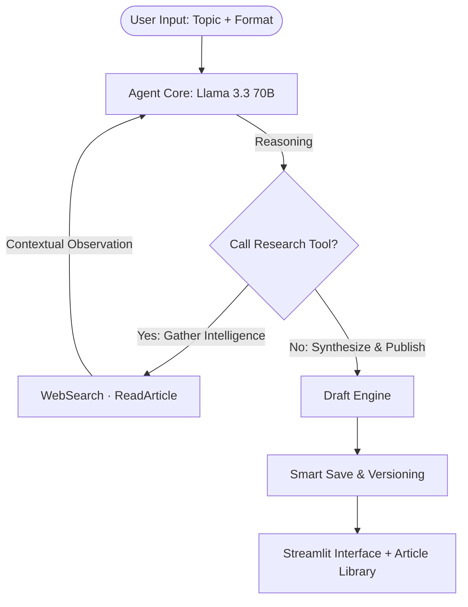

# ✍️ PublishAI Content Agent

An **autonomous research and digital publishing agent** that crawls the web, extracts deep technical insights, and crafts high‑impact LinkedIn posts and long‑form articles — all on a **zero‑cost infrastructure**.  
Part of the [OmniAgent Engine](../../README.md) ecosystem, it saves hours of manual research and writing while consistently delivering authoritative, viral‑ready content.

---

## 🏗️ System Architecture & Workflow

The agent executes a deterministic **ReAct (Reason + Act)** loop. The core LLM decides whether to invoke a research tool or to emit a final publication‑ready draft. Research is enforced programmatically, articles are fully extracted, and every draft is automatically saved with descriptive, versioned filenames.



### 🧠 Core Engine Specifications

- **LLM Backend:** Groq Cloud – configurable model (default `llama-3.3-70b-versatile`). Free tier supports ~30 requests/min and 14,400 tokens/min.
- **Orchestration:** Pure Python with `langchain-core` message handling – no heavy framework overhead.
- **Memory:** Ephemeral conversation buffer (resets on each Streamlit rerun).

---

## ⚡ Key Capabilities & Tools

- **Autonomous Research:** Locates the top 2‑3 recent (2025‑2026) articles on any topic, extracts their full text, and synthesises key insights, data points, and quotes.
- **Viral Content Engineering:** Generates LinkedIn posts or full articles with a *spiky point of view*, emotional arc, data‑backed claims, and interactive engagement elements.
- **WebSearch:** Leverages the official `duckduckgo_search` library to return **real URLs**, titles, and snippets – no hallucinated links.
- **ReadArticle:** Dual‑mode article extraction:  
  – **Jina AI Reader** for fast, clean markdown.  
  – **Direct HTTP fetch + `trafilatura`** to bypass paywalls and strict CORS policies.
- **SaveDraft:** Automatically writes drafts with **smart filenames** derived from the article heading or user prompt, plus automatic versioning (`_v2`, `_v3`…) for repeated topics.

---

## 📚 Built‑in Article Library

The Streamlit UI automatically scans the `drafts/` directory and displays all previously generated articles in a collapsible library at the top of the page.  
When a new article is generated, the library **automatically expands** and highlights the freshly saved file – no scrolling required.

---

## 📋 Prerequisites & API Access

- **Python Version:** `>= 3.10` (we recommend **3.12** for full binary compatibility and trouble‑free dependency installation).
- **Groq API Key:** [Sign up for free](https://console.groq.com) – no credit card needed. See our [Step‑by‑Step Groq API Key Setup Guide](docs/Step-by-Step-Groq-API-Key-Setup-Guide.md).
- **Zero additional API costs** – all web search and content extraction is completely free.

### Dependencies (`requirements.txt`)

```text
streamlit
langchain-groq
langchain-core
langchain-community
duckduckgo-search
requests
beautifulsoup4
trafilatura
python-dotenv
```

---

## ⚙️ Installation & Setup

```bash
# 1. Navigate to the agent module
cd agents/PublisherAI

# 2. Create a dedicated virtual environment
python -m venv venv
source venv/bin/activate   # Windows: venv\Scripts\activate

# 3. Install required packages
pip install -r requirements.txt
```

---

## 🔧 Configuration

All runtime settings are controlled through environment variables (via a `.env` file).  
Create a `.env` file in the project root:

```env
# === Required ===
GROQ_API_KEY=gsk_your_key_here

# === LLM Settings ===
GROQ_MODEL=llama-3.3-70b-versatile
GROQ_TEMPERATURE=0.7

# === Agent Behaviour ===
AGENT_MAX_ITERATIONS=12
SEARCH_MAX_RESULTS=3

# === Logging ===
LOG_FILE=logs/agent.log
LOG_CONSOLE_LEVEL=INFO
LOG_FILE_LEVEL=DEBUG
LOG_CONSOLE_FORMAT=%(asctime)s | %(levelname)-7s | %(name)s | %(message)s
LOG_FILE_FORMAT=%(asctime)s | %(levelname)-7s | %(name)s | %(filename)s:%(lineno)d | %(message)s
LOG_DATE_FORMAT=%Y-%m-%d %H:%M:%S
```

- The **system prompt** is loaded from `used-prompt/system-prompt/system-prompt.md`, allowing you to iteratively improve the agent’s behaviour without modifying any code.
- All log files are written to the `logs/` folder (automatically created).

> [!TIP]
> **Need a Groq API Key?**  
> Follow our detailed, screenshot‑based **[Groq API Key Setup Guide](docs/Step-by-Step-Groq-API-Key-Setup-Guide.md)** to obtain and secure your credentials.

---

## 🆓 Free‑Tier Groq Models

All models below are available **instantly with a free Groq API key**.  
Just change `GROQ_MODEL` in your `.env` file and restart the agent.

| Model ID | Context Window | Best For | Speed / Quality |
|----------|----------------|----------|-----------------|
| `llama-3.1-8b-instant` | 131,072 tokens | 🚀 Fastest: quick posts, rapid iteration | Maximum speed, simpler prose |
| `llama-3.3-70b-versatile` | 131,072 tokens | 🧠 Best balance: rich articles, deep research | 2‑3× slower, highest quality |
| `mixtral-8x7b-32768` | 32,768 tokens | ⚡ Strong reasoning, great technical posts | Faster than 70B, nearly as capable |
| `gemma2-9b-it` | 8,192 tokens | 🧪 Lightweight / experimental tasks | Very fast, limited context |
| `llama-3.2-11b-vision-preview` | 128,000 tokens | 🖼️ Multimodal (text + image) | Good speed, vision features |


### 🧪 Which one should you use?

- **For daily content drafting:** `llama-3.3-70b-versatile` (quality) or `mixtral-8x7b-32768` (speed + quality).
- **If you want lightning‑fast iterations:** `llama-3.1-8b-instant` – excellent for short LinkedIn posts.
- **All are free** under Groq’s rate limits: ~30 requests/minute, 14,400 tokens/minute (may vary, check [console.groq.com](https://console.groq.com) for current limits).

Just swap the `GROQ_MODEL` in your `.env` file:

```env
GROQ_MODEL=mixtral-8x7b-32768
```

And restart the app – no other changes needed.

---

## 🚀 Running the Agent

```bash
streamlit run streamlit_app.py
```
The UI opens at **`http://localhost:8501`**.

### Example Prompts

- *“Write a LinkedIn post comparing Rust’s async ecosystem with Go’s goroutines for high‑performance services.”*
- *“Create a detailed article on WebAssembly in 2026 – beyond the browser.”*
- *“I need a post about the top 5 API security threats, backed by recent data.”*

### Expected Workflow

1. Agent **forces a web search** – it cannot skip research.
2. It **reads at least one full article** using a real URL extracted from the search results.
3. The LLM synthesises the findings and writes the final post/article.
4. The draft is **auto‑saved** with a descriptive, versioned filename and immediately accessible in the article library.

---

## 📝 Logging

Structured logs are written to the `logs/` folder for troubleshooting and observability.  
By default, all modules write to a single, configurable log file (see `.env`):


If something goes wrong, inspect `logs/publisher-ai.log` first for stack traces and debug context.

```TEXT
[2026-07-25 10:40:34] | [INFO] | [PublishAI] | [streamlit_app.py:11] | Starting PublishAI Streamlit app
[2026-07-25 10:40:34] | [INFO] | [PublishAI] | [streamlit_app.py:16] | Scanning drafts directory...
[2026-07-25 10:40:34] | [INFO] | [PublishAI] | [streamlit_app.py:42] | Found articles: 3
[2026-07-25 10:41:05] | [INFO] | [PublishAI] | [streamlit_app.py:11] | Starting PublishAI Streamlit app
[2026-07-25 10:41:05] | [INFO] | [PublishAI] | [streamlit_app.py:16] | Scanning drafts directory...
[2026-07-25 10:41:05] | [INFO] | [PublishAI] | [streamlit_app.py:42] | Found articles: 3
[2026-07-25 10:41:05] | [INFO] | [PublishAI] | [streamlit_app.py:94] | User submitted input (truncated): Detailed Article on SOLID Principle with Example
[2026-07-25 10:41:05] | [INFO] | [PublishAI] | [streamlit_app.py:102] | Invoking agent_executor for user input
[2026-07-25 10:41:05] | [INFO] | [PublishAI] | [agent.py:46] | New request: Detailed Article on SOLID Principle with Example
[2026-07-25 10:41:05] | [INFO] | [PublishAI] | [agent.py:52] | Agent iteration 1/12
[2026-07-25 10:41:05] | [INFO] | [PublishAI] | [tools.py:88] | WebSearch called with query: "SOLID Principle example site:medium.com OR site:dev.to"
[2026-07-25 10:41:06] | [INFO] | [PublishAI] | [tools.py:102] | ReadArticle called with URL: https://medium.com/@example/solid-principle-example-123456
[2026-07-25 10:41:08] | [INFO] | [PublishAI] | [agent.py:52] | Agent iteration 2/12
[2026-07-25 10:41:08] | [INFO] | [PublishAI] | [agent.py:72] | Draft generated and saved to drafts/2026-07-25/solid-principle-example_v1.md
```


---

## 📁 Project Structure

```
PublisherAI/
├── agent.py                  # Core ReAct loop, research enforcement, auto‑save
├── tools.py                  # WebSearch, ReadArticle, SaveDraft
├── streamlit_app.py          # Streamlit UI + article library + auto‑expand
├── system-prompt.md          # Editable system prompt (loaded at runtime)
├── config.py                 # Environment‑based configuration helper
├── logger.py                 # Centralised, configurable logging setup
├── requirements.txt
├── .env                      # API keys and runtime settings (not committed)
├── README.md
├── logs/                     # Auto‑created log files
│   └── agent.log
└── drafts/                   # Auto‑created date‑based folders
    └── 2026-07-25/
        ├── rust-vs-go-for-systems-programming.md
        └── spring-boot-security-best-practices_v2.md
```

---

## 🧪 Testing & Validation

1. **Tool Verification** – Run `tools.py` interactively to test search and article reading independently.
2. **Prompt Validation** – Use the sample prompts above; click the **Debug** expander in the UI to confirm real articles are being read.
3. **Smart Naming** – Generate several articles on related topics and verify that automatic versioning produces `..._v2.md`, `..._v3.md`, etc.
4. **Log Integrity** – Check `logs/publisher-ai.log` after a generation to see the entire research‑to‑publish pipeline.

---

## 🛡️ Guardrails & Limits

- **Loop Safety:** The agent is capped at a configurable **maximum number of ReAct iterations** (default 12) to prevent runaway loops.
- **File Sandboxing:** All write operations are confined to the `drafts/` directory.
- **Free‑Tier Compliance:** Research and inference operate well within Groq’s free limits.
- **Graceful Fallback:** If every article read fails, the agent produces a useful post from search snippets, explicitly noting its sources.

---

## 🙌 Acknowledgements

- **Inference:** [Groq Cloud](https://groq.com) for the ultra‑fast LLM API.
- **Search:** [DuckDuckGo](https://duckduckgo.com) for unrestricted, anonymous web queries.
- **Content Extraction:** [Jina AI Reader](https://jina.ai) and [trafilatura](https://trafilatura.readthedocs.io/) for robust article parsing.
- **UI Framework:** [Streamlit](https://streamlit.io) for turning Python into a polished interface with zero front‑end code.

---

**PublishAI Content Agent** – *research less, write more, and make every post count.* ✍️
```