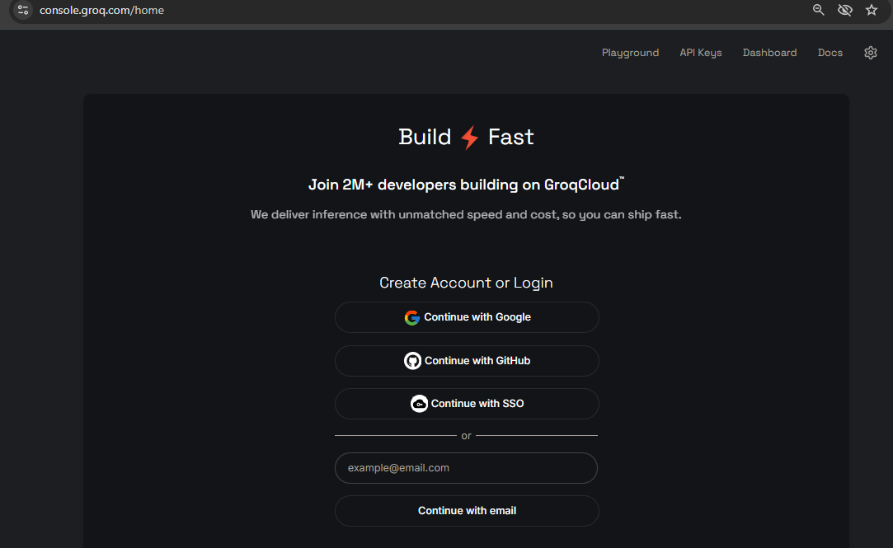
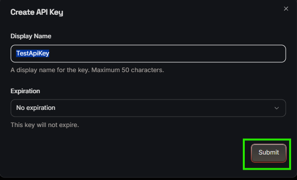
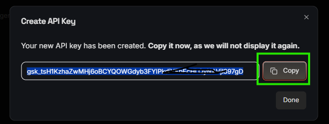

## 🔑 Step-by-Step Groq API Key Setup Guide
To use the PublisherAI Agent, you need a free API key from Groq Cloud. Follow these steps to generate yours:
## Step 1: Create an Account

1. Open your browser and navigate to the [Groq Cloud Console](https://console.groq.com/).
2. Sign up using your Email, Google account, or GitHub account. (No credit card is required).

 

## Step 2: Navigate to API Keys

1. Once logged into the dashboard, look at the left-hand sidebar menu.
2. Click on the "API Keys" tab.

 

## Step 3: Generate the Key

1. Click the prominent "Create API Key" button in the center or top right of the page.
2. In the pop-up window, give your key a recognizable name (e.g., omniagent-engine-content-creator).
3. Click "Submit" or "Create".

 

## Step 4: Copy and Secure Your Key

1. Critical: Copy the generated key immediately (it starts with gsk_...).
2. Note: Groq will only show this key to you once. If you close the window without copying it, you will have to create a new one.
3. Paste this key directly into your local .env file as shown in the configuration guide below.

 

